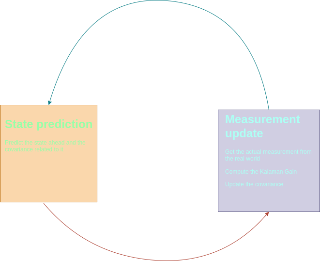
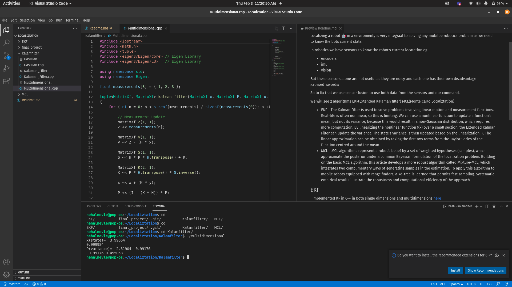
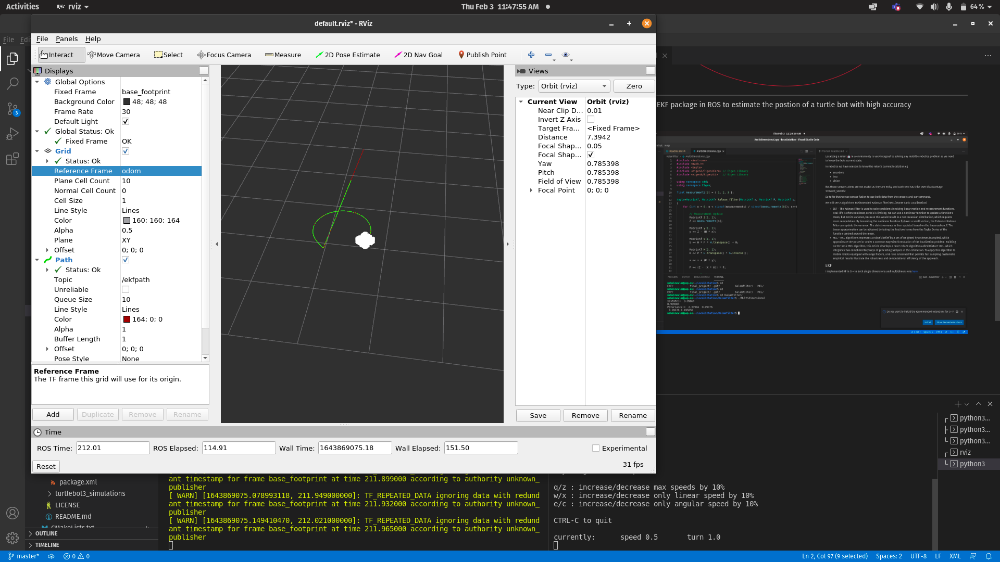
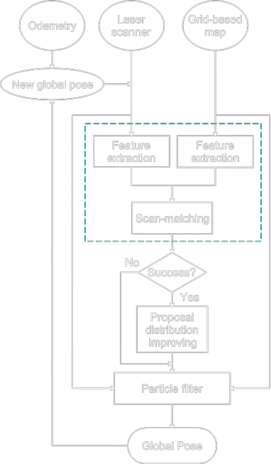
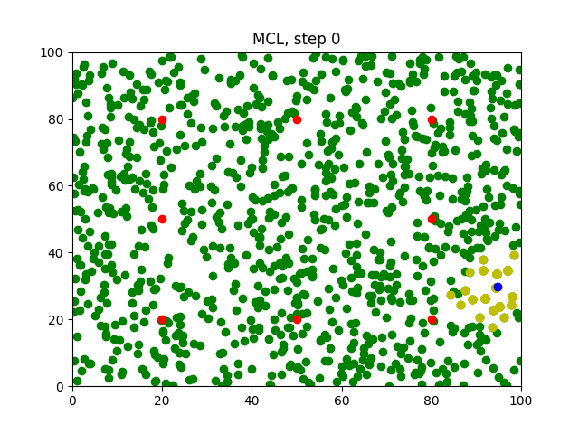
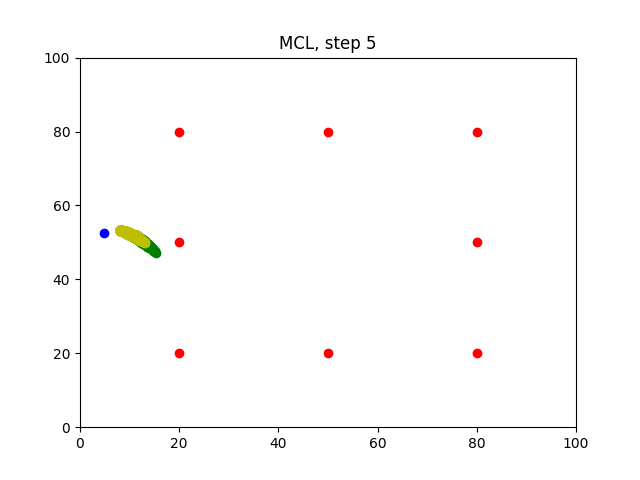
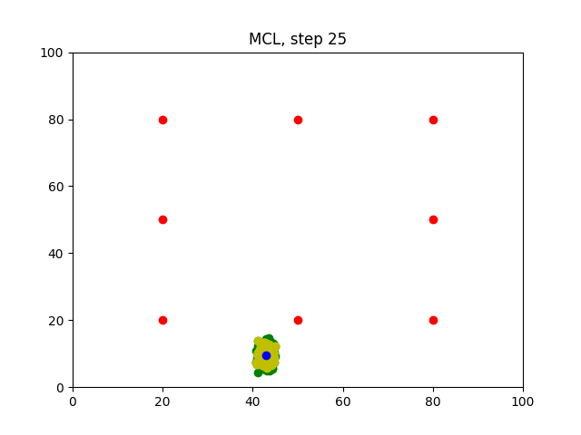
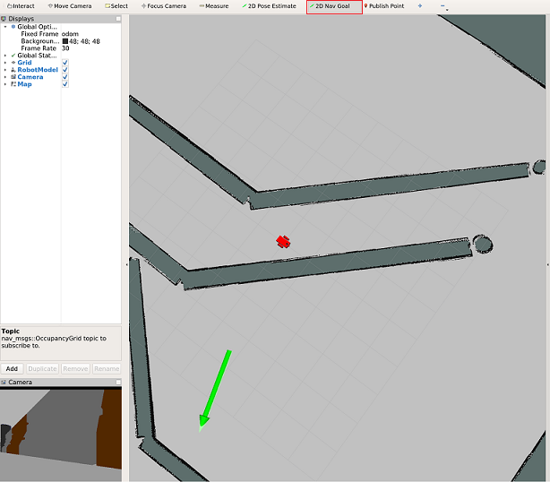
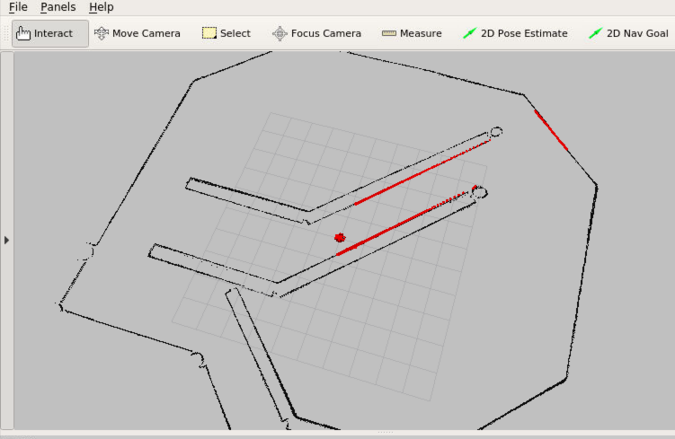
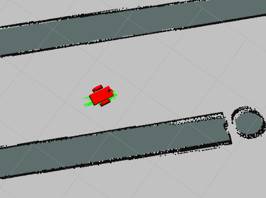

# Localiztation 🔽
Localizing a robot 🤖 in a enviromenty is very integraal to solving any mobilbe robotics problem as we need to know the bots current state.

In robotics we have sensors to know the robot's current locatation
eg 
- encoders
- imu
- vision

But these sensors alone are not useful as they are noisy and each one has thier own disadvantage :crossed_swords:

So to fix that we use sensor fusion to use both data from the sensors and our command.

We will see 2 algorithms EKF(Extended Kalaman filter) MCL(Monte Carlo Localiztation)

- EKF - The Kalman Filter is used to solve problems involving linear motion and measurement functions. Real-life is often nonlinear, so this is limiting. We can use a nonlinear function to update a function's mean, but not its variance, because this would result in a non-Gaussian distribution, which requires more computation. By linearizing the nonlinear function f(x) over a small section, the Extended Kalman Filter can update the variance. The state's variance is then updated based on the linearization, F. The linear approximation can be obtained by taking the first two terms from the Taylor Series of the function centred around the mean.
- MCL -  MCL algorithms represent a robot’s belief by a set of weighted hypotheses (samples), which approximate the posterior under a common Bayesian formulation of the localization problem. Building on the basic MCL algorithm, this article develops
a more robust algorithm called Mixture-MCL, which integrates two complimentary ways
of generating samples in the estimation. To apply this algorithm to mobile robots equipped
with range finders, a kd-tree is learned that permits fast sampling. Systematic empirical
results illustrate the robustness and computational efficiency of the approach.

## EKF

I implemented KF in C++ in both single dimensions and multidimensions <a href="https://github.com/Blackcipher101/Localiztation/blob/master/Kalamfilter/Kalaman_Filter.cpp">here</a>
### Flowchart

---
I also used the EKF package in ROS to estimate the postion of a turtle bot with high accuracy.
### Results

## MCL

I implemted MCL algorithm in C++ and visualized it matpolib<a href="">here</a>.
### Flowchart

### Start

### Midway

### End

---
Also implemted this in ROS using ACML package and movebase.

# Feedback
Feel free to contact me at nehalnevle@gmail.com would be great if you left a star to this project

